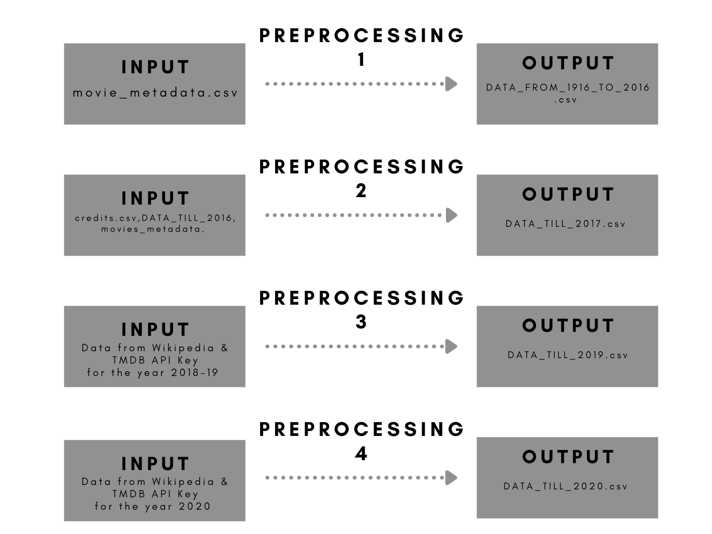

# MOVIE-RECOMMENDATION-SYSTEM
This is just the back-end part of the movie recommendation system it covers the Data scraping , Pre processing of the data , Also i have created a Sentiment analysis model which converts the viewers review into sentiments. 
#### IMPORTANT NOTE : I WAS NOT ABLE TO UPLOAD FEW OF THE DATA SETS DUE TO DATA STORAGE LIMIT [credits (INPUT), movies_metadata (INPUT)] BOTH OF THIS FILES BELONG TO PREPROCESSING 2 FOLDER 
#### LINK FOR THE REMAINING FILES "https://cutt.ly/akfNJIY"
* I HAVE RENAIMED THE FOLDER & FILES NAME FOR BETTER UNDERSTANDING
## LET'S GET STARTED! 
### This data science project can be divided into two main parts 
#### 1. Data Preprocessing : During data preprocessing we used kaggele data set, TMDB movie dataset which we scraped using API key method as well as we learned about data web scraping from wikipedia, This data collected from various sources was not in same format, So we created a standerd format by preprocessing. The final format for our data set was ["director_name, actor_1_name, actor_2_name, actor_3_name, genres, movie_title "]. All the steps we followed for the pre processing are mentioned in the respective .ipynb files.
* How to get TMDB API Key : Follow this Youtube tutorial "https://youtu.be/mbImkkJFxBs"

#### 2. Sentiment analysis model : For sentement analysis we used 'user review' data from kaggle.com And converted that text data into Vectors, At the end using 'Multinomial naive bayes algorithm' we get our model with the accuracy of 97.471%,
* Multinomial Naïve Bayes uses term frequency i.e. the number of times a given term appears in a document. ... After normalization, term frequency can be used to compute maximum likelihood estimates based on the training data to estimate the conditional probability.
## Technology and tools this project covers
1. Python
2. Numpy and Pandas for data cleaning
3. Matplotlib for data visualization
4. ast module for converting string to list
5. tmdbv3api for data scraping (As the genres column was missing in kaggle dataset)
6. json
7. requests.PyPI
8. beautifulsoup4·PyPI
9. urllib.request
10. scikit-learn

### VISUAL REPRESENTATION OF THE PRE PROCESSING PROCESS

